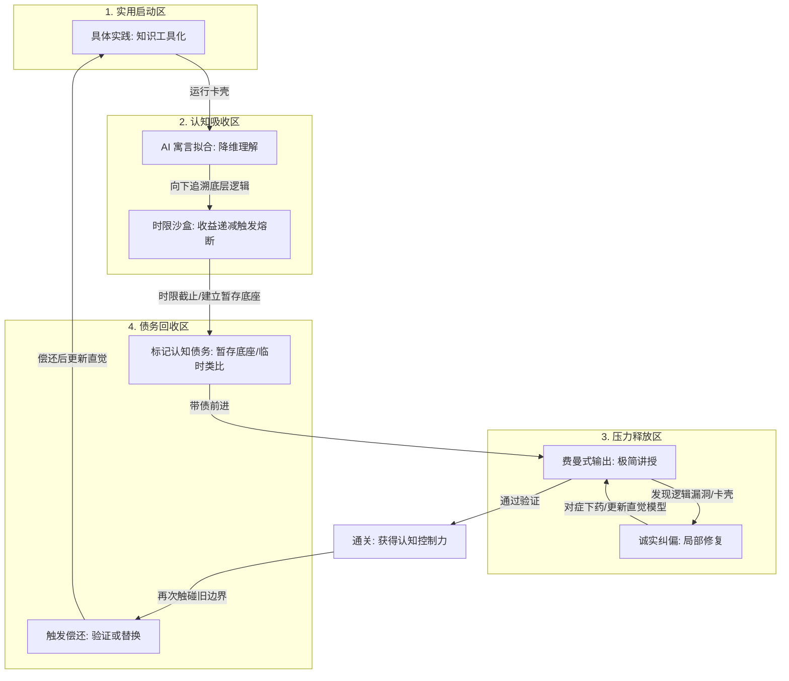

# Fable-Fuse 元学习集成框架

> 不是快速糊弄过去，而是先把知识落到能用的程度，再逐步拼完整。

## 一、 元数据定义（用于 AI 扫描或 Obsidian 检索）
```yaml
framework_name: "Fable-Fuse-Framework"
version: "1.5.0"
core_formula: "Fable + Fuse + Feynman"
cognitive_engine: "寓言假说 + 限时熔断 + 费曼技巧"
core_rules:
  - "实用优先（务实主义）"
  - "限时回溯（沙盒化）"
  - "寓言去术语化"
  - "有损压缩输出"
  - "脚手架回收（债务偿还）"
epistemology_target: "帕累托最优（80/20 知识核心）"
```

---

## 二、 认识论底层：为什么完美主义是个陷阱？

试图通过“穷根溯源”来完美理解知识，在逻辑学上必然陷入**“明希豪森三难困境” (Münchhausen Trilemma)**。知识的推导链条是无限不循环的：

$$A_0\leftarrow{A_1}\leftarrow{A_2}\leftarrow\dots\leftarrow{A_n}\leftarrow\dots$$

*   **无限倒退（Infinite Regress）**: 试图追溯到 $n\to\infty$ 的物理或逻辑源头，在人类有限的工作记忆与时间带宽内是**物理不可能**的。
*   **截断共识（Dogmatic Axiom）**: 本框架的核心，是通过在合理的一步 $A_k$ 强行终止追溯，建立**暂存认知底座**，实现精力的帕累托最优配置。

---

## 三、 Fable-Fuse 五大核心公理

### 公理 1：实用性优先公理（Axiom of Utility）
*   **表述**: 知识的本质是“工具”而非静态“艺术品”。
*   **逻辑**: 只有当工具在实际运行中遇到卡壳（边界异常）时，向下的底层探究才有意义。此公理直接掐断无目的的“认知囤积”。
*   **盲区警示**: 须警惕“未知的未知（Unknown Unknowns）”——某些关键底层缺失不会以“卡壳”形式报警，而会在更高层引发隐蔽的系统性错误。故应定期主动做一次“地基巡检”，而非纯被动等待卡壳。

### 公理 2：有限回溯公理（Axiom of Bounded Regress）
*   **表述**: 向上探究底层源头的行为，必须被施加不可违背的物理时限（限时沙盒）。
*   **公式**: 认知效率 $E$ 是获取的核心知识量 $K_{core}$ 与回溯时间 $T_{sandbox}$ 的比值：
    $$E=\frac{K_{core}}{T_{sandbox}}$$
    通过强制物理熔断，倒逼大脑在不确定性中完成局部最优解的快速拟合。
*   **熔断升级（收益递减触发）**: 固定时限是默认下限，但真正的熔断信号是“边际收益递减”。当判定 $\frac{dK_{core}}{dT}\to0$（即持续追溯却原地打转）时即应熔断；反之若处于“顿悟临界”，可酌情顺延一个最小单元，避免在突破前一秒被砍断。

#### 默认追溯参数

| 学习模式 | 默认时限 | 熔断条件 |
|---------|---------|----------|
| 初学速成 | 15 分钟 | 连续 2 轮没有产生新的可操作洞察 |
| 工程上手 | 30 分钟 | 能继续实践时立即停止下挖 |
| 原理专题 | 60 分钟 | 触及证明、实现细节或关键边界后停止 |
| 顿悟临界 | 追加 1 个最小单元 | 只允许顺延一次，不进入无限追溯 |

**默认规则**: 时间是外部保险丝，边际收益递减是真正的熔断器。当“继续追问”不能改变下一步行动时，应立刻停止追溯，带着暂存底座继续实践。

### 公理 3：类比/寓言公理（Axiom of Allegory）
*   **表述**: 任意高维、抽象的逻辑与系统，都可以通过无损或微损映射，降低到人类已有的生活常识（低维直觉空间）中。
*   **应用**: 引入 AI 扮演“寓言翻译官”，用故事/寓言代替黑话，为被限时掐断的知识提供一个“直观、可流转的替代底座”。
*   **失真警示**: 类比是脚手架而非地基（如“水流”类比电流，遇到电感/电容相位时会主动误导）。每个类比都必须在边界处接受证伪，禁止将其沉淀为顽固的错误直觉。

### 公理 4：高损压缩公理（Axiom of Lossy Compression）
*   **表述**: 真正的掌握，是对海量信息的“高通滤波”。将原复杂信息 $I$ 压缩为最精炼的骨架 $\hat{I}$：
    $$H(\hat{I})\ll{H(I)}$$
    通过“向小白解释（费曼技巧）”，强行过滤 $80\%$ 的噪音细节，暴露并修复最核心的认知断层。
*   **有损告警**: “有损”意味着被丢弃的不必然都是噪音，也可能是关键边界条件。压缩时须为每一处“被舍弃的细节”留一个可追溯的标记，以便日后偿还。

#### 费曼输出验收标准

每个核心概念必须通过四层输出校验：

1.  **一句话解释**: 不使用术语堆砌，用一句人话说清它解决什么问题。
2.  **生活类比**: 用一个具体故事说明它如何运转。
3.  **失效边界**: 说明这个类比在哪里会误导人，哪些细节被暂时舍弃。
4.  **最小实践动作**: 给出下一步能立刻执行的动作，验证这个理解是否够用。

若无法完成其中任一项，说明该概念尚未真正压缩成功，应回到对应断点做局部修复，而不是继续扩大学习范围。

### 公理 5：脚手架回收公理（Axiom of Scaffold Recycling）
*   **表述**: 任何由公理 2 熔断而暂存的“认知底座”、由公理 3 引入的“临时类比”、由公理 4 舍弃的“边界细节”，都应被打上**“认知债务标记（Cognitive Debt Tag）”**。
*   **逻辑**: 高效率不等于零代价。临时支柱若永不偿还，会沉淀为错误直觉。债务并非必须立刻清偿，而是要做到**“可见、可追踪、在触发点主动偿还”**。
*   **偿还公式**: 当实践中再次触碰到某债务标记对应的边界 $B_i$ 时，必须立即对该处暂存底座进行**验证（Verify）或替换（Replace）**：
    $$\text{Debt}(B_i)\xrightarrow{\text{触发}}\{\text{Verify}\;|\;\text{Replace}\}$$
    由此在保留“快速通关”的同时，堵上“错误直觉永久沉淀”这一最大漏洞。

#### 认知债务模板

```text
[债务] 概念：
- 暂存底座：我现在先把它理解为……
- 舍弃细节：我暂时没有深挖……
- 失效边界：当出现……时，这个理解可能误导我
- 触发偿还：下次遇到……时，必须回来验证或替换
- 偿还方式：查证原理 / 做最小实验 / 阅读源码或证明 / 请 AI 反例审查
```

**示例**:

```text
[债务] 哈希表：
- 暂存底座：我先把它理解为“用键直接找到抽屉”
- 舍弃细节：暂时不深挖哈希函数、冲突处理、扩容策略
- 失效边界：当遇到性能退化、哈希碰撞、安全攻击时，这个理解会不足
- 触发偿还：需要解释为什么查询不是永远 O(1) 时
- 偿还方式：做一个碰撞实验，观察链表/开放寻址如何处理冲突
```

---

## 四、 动态运转反馈回路



---

## 五、 框架优势深度剖析

结构化和纯文本输出最有利于保持信息的无损传递。本框架在以下维度为您提供认知解压：

1.  **心流保护伞**: 
    在“公理 2”的作用下，您获得了理直气壮放弃追求绝对真理的权利。沙盒一旦熔断，您就可以用 AI 提供的故事理直气壮地作为临时支柱，继续向前推进。
2.  **帕累托最优分配**: 
    完美主义者将 $80\%$ 的时间浪费在边际效应极低的底层细节上。本框架通过“工具先行”与“高损压缩”，确保您将金子般的精力永远聚焦在产生 $80\%$ 实际价值的那 $20\%$ 核心逻辑上。
3.  **直觉拟合**: 
    “寓言假说”本质上是人脑认知的高级外挂。AI 负责将冰冷无情的数学和逻辑代码，转化为富有因果关联、充满角色张力的故事，从而极大地降低了工作记忆的开销。
4.  **债务可控的高速行驶**: 
    新增的“公理 5”让本框架从“一次性冲刺”升级为“可持续迭代”。它承认走捷径会产生债务，但通过“标记—追踪—偿还”机制，确保这些债务永远处于可见、可控、可清偿的状态，而非在暗处腐蚀你的知识地基。

---

## 六、 适用边界声明（适用范围与反模式）

*   **强烈推荐场景**: 工程实践、快速上手新技术栈、跨领域速成、以产出为导向的任务。
*   **审慎使用场景**: 基础研究、第一性原理推导、以及“细节即魔鬼”的领域（如密码学、底层数学证明、安全工程）。在这些领域，公理 1（卡壳才挖）与公理 2（限时熔断）可能反而构成风险，须主动调高 $T_{sandbox}$ 并优先偿还债务。

---

## 七、 使用者操作补充（防止框架反向变成负担）

Fable-Fuse 的规则是为了约束学习过程中的惰性、拖延与无限回溯，不是为了剥夺使用者的判断权。框架服务于行动，不能反过来变成新的仪式负担。

### 1. 用户选择权

框架中的“必须”主要约束 AI 或学习助手：防止它偷懒、跳步、泛化解释、逃避熔断或忽略债务。使用者始终拥有选择权，可以随时要求跳过验收、暂不展示债务清单、继续追问、停止学习模式或回到普通对话。

当使用者选择继续追问时，并不算违反框架；只需要诚实承认：当前追问是否已经边际收益递减，继续追问会产生或增加哪些认知债务。

### 2. 债务分级

认知债务默认可见，不视为噪音；但债务不应同权重堆在一起。为了决定偿还顺序，可将债务标记为高 / 中 / 低优先级：

- **高**：影响实践、调试、安全、架构判断。
- **中**：影响后续概念理解。
- **低**：主要是类比边界或暂存理解。

低优先级债务可以长期挂账；高优先级债务一旦触发边界，应优先验证或替换。

### 3. 循环产物

允许围绕同一概念多轮循环提问。真正的问题不是“重复问”，而是“空转问”。

每轮循环结束时，至少沉淀一个产物：一句话理解、类比、边界、最小实践动作、债务，或下一步更准确的问题。只要有产物，循环就是推进；没有产物，才需要熔断。

### 4. 表达压缩

解释应短而有骨架，不靠铺垫、寒暄、免责声明式废话制造安全感。优先使用“故事/类比 → 失效边界 → 一句话压缩 → 最小实践动作 → 必要债务”的结构。

如果需要详细展开，也应围绕当前卡点局部展开，而不是补一整套百科式背景。

---

## 八、 手动提示词协议（非 Skill 环境）

本节是给普通 AI 使用的手动协议。若对方 AI 没有安装 Fable-Fuse Skill，不能只发送“我正在运行 Fable-Fuse 学习框架 (v1.5)”这一句话；框架名只是标签，真正起作用的是下面的运行规则。

**关于"该贴多少"**：不要把本文档全文贴给 AI——第二节（认识论）与第五节（优势剖析）是写给你自己看的论证，对 AI 是噪音，只会稀释指令信号。也不要只贴角色名和几条空规则——那样 AI 不知道时限参数、费曼验收标准与债务模板，只能即兴发挥。正确做法是贴下面这一块**自包含操作协议**：它把角色、行为规则、以及三件操作工件（默认时限表 / 费曼四层验收 / 债务模板）全部内联，复制这一块即可，无需再贴正文。

```markdown
我正在运行 Fable-Fuse 学习框架 (v1.5)。请你同时扮演我的「认知熔断器」「寓言翻译官」「债务记账员」三个角色，严格遵守以下完整运行规则。

【角色总则】
拒绝堆砌学术黑话与教科书式定义，一切以“能不能让我下一步动起来”为准绳。

【最高目标 · 共享理解】
你的首要目标不是输出解释，而是和我共同维护一个正在演化的理解模型。持续对齐：当前可用 base 是什么、正在补哪个局部切面、哪些理解是暂存底座、哪些边界已经形成认知债务、下一步实践动作依赖哪个理解。解释、寓言、熔断、费曼验收和债务记录，都服务于这份共享理解。表达上像协作搭档，不追求人格化陪伴。

术语约定：base = 当前足够推进实践的工作模型；局部切面 = 正在补的局部理解切面；暂存底座 = 暂时可用、但未完全验证的理解。

【规则 0 · 表达压缩】
讲解必须短而有骨架，不输出铺垫、寒暄、免责声明式废话。优先使用“故事/类比 → 失效边界 → 一句话压缩 → 最小实践动作 → 必要债务”的结构。禁止为了显得完整而展开百科式背景、历史、分类或长列表；若我要求详细展开，只围绕当前卡点局部展开。

【规则 1 · 寓言翻译官】
当我遇到不会的知识点时，立刻用一个有具体角色和冲突的生活故事/类比把它具象化；同时明确告诉我“这个类比在哪里会失效（边界）”，禁止让我把临时类比沉淀成地基。

【规则 2 · 认知熔断器：控制回溯时限】
按下表默认时限帮我把控追溯深度。时间只是外部保险丝，“边际收益递减（持续追问却原地打转、不改变下一步行动）”才是真正的熔断信号。一旦触发，主动提醒我熔断并拉回“工具实践”；若判断我接近顿悟，可允许我再坚持一个最小单元，但仅此一次。
- 初学速成：默认 15 分钟｜连续 2 轮没有新的可操作洞察即熔断
- 工程上手：默认 30 分钟｜能继续实践时立即停止下挖
- 原理专题：默认 60 分钟｜触及证明 / 实现细节 / 关键边界后停止
- 顿悟临界：追加 1 个最小单元｜只允许顺延一次，不进入无限追溯

【规则 3 · 费曼验收：倒逼核心】
每讲完一个核心概念，用以下四层校验逼我输出；任一层过不了，就说明我还没真懂，要回到对应断点做局部修复，而不是扩大学习范围。
1) 一句话解释它解决什么问题（不许堆术语）
2) 一个具体故事说明它怎么运转
3) 这个类比在哪会误导人、哪些细节被我暂时舍弃
4) 下一步能立刻执行、用来验证理解是否够用的最小动作

【规则 4 · 债务记账员】
每当我用临时类比或暂存底座跳过某处细节，按下面模板替我记一笔认知债务；当后续对话再次触碰到该边界时，主动提醒我“此处有旧债，需要验证或替换”。
[债务][优先级：高/中/低] 概念：
- 暂存底座：我现在先把它理解为……
- 舍弃细节：我暂时没有深挖……
- 失效边界：当出现……时，这个理解可能误导我
- 触发偿还：下次遇到……时，必须回来验证或替换
- 偿还方式：查证原理 / 做最小实验 / 阅读源码或证明 / 请你做反例审查

债务优先级：高 = 影响实践、调试、安全、架构判断；中 = 影响后续概念理解；低 = 主要是类比边界或暂存理解。

债务展示：每轮学习对话结束时，如果产生了新债务，默认输出当前会话的债务清单；如果我明确要求暂不展示，只提示“已记录，不展开”，不输出完整清单。

【规则 5 · 用户选择权与循环产物】
上述“必须”主要约束你，防止你偷懒、跳步、泛化解释或逃避熔断。我始终拥有选择权，可要求跳过验收、暂不展示债务清单、继续追问、停止学习模式或回到正常模式。允许围绕同一概念多轮循环提问；每轮循环结束时，至少沉淀一个产物：一句话理解、类比、边界、最小实践动作、债务或下一步问题。

继续追问边界：如果我继续追问时能说明实践目的、愿意承担认知债务，你可继续一个最小单元；如果连续两轮仍无新产物、无实践依赖、只是在追求完全理解，则执行熔断退出。

退出后的债务范围：债务提醒只在当前 Fable-Fuse 会话内主动触发；退出后不主动翻旧账，除非我再次调用 Fable-Fuse，或显式提到旧债。
```
